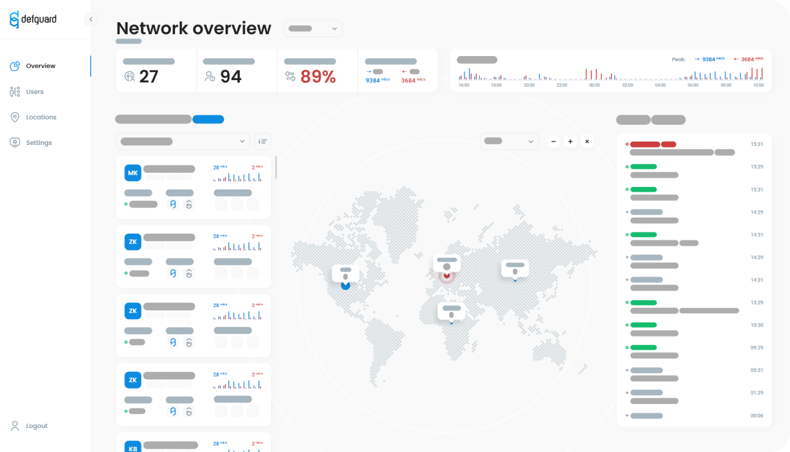

 <p align="center">
    
 </p>

Defguard is an open-source identity management system made with the aim to make company managment as easy as possible.

**Problems that DefGuard adresses and solves**

* Your company has a self-hosted services, e.g.: Git/Jira/Slack etc. and wants an easy-to-use central logging system with simple and nice UI
* Fast and easy to setup VPN (Remote access to company resources as above)
* Webhooks triggered after taking specified actions on user sending user data to provided URL which allows you to automate stuff like sending welcome mail or creating accounts in different services

**Features:**

* OpenID connect provider
* Wireguard VPN management
* LDAP synchronization
* Webhooks
* Yubikey Provisioning

 <p align="center">
    
 </p>

See the [documentation](https://defguard.gitbook.io) for more information.

# Development environment setup

Remember to clone DefGuard repository recursively (with protos):

```
git clone --recursive git@github.com:DefGuard/defguard.git
```

## With Docker Compose

Using Docker Compose you can setup a simple stack with:

* backend
* database (PostgreSQL)
* VPN gateway
* device connected to the gateway
* ldap

This way you'll have some live stats data to work with.

To do so follow these steps:

1. Migrate database and insert test network and device:

```
docker compose run core init-dev-env
```

2. Run the application:

Without LDAP:

```
docker compose up
```

With LDAP:

```
docker compose -f docker-compose.ldap.yaml up
```

## Cargo

To run backend without Docker, you'll need:

* PostgreSQL database
* Environment variables set

Run PostgreSQL with:

```
docker compose up -d db
```

You'll find environment variables in .env file. Source them however you like (we recommend https://direnv.net/).
Once that's done, you can run backend with:

```
cargo run -- --grpc-cert ssl/defguard.crt --grpc-key ssl/defguard.key
```

## SSL

In `ssl` directory you'll find self-signed certificates for local development (cargo run, docker-compose).
