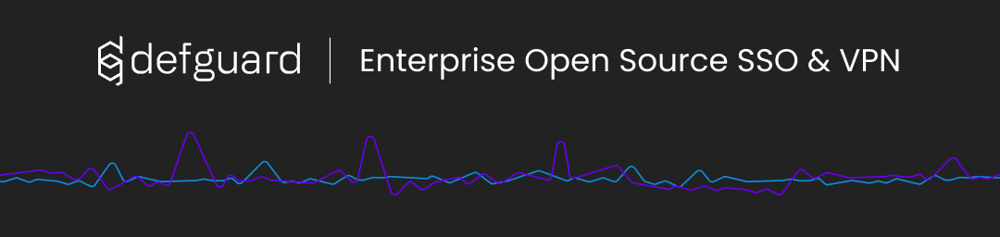

 <p align="center">
    
 </p>

Defguard is an open-source identity management system made with the aim to make company managment as easy as possible.

**Problems that DefGuard adresses and solves**

* Your company has a self-hosted services, e.g.: Git/Jira/Slack etc. and wants an easy-to-use central logging system with simple and nice UI
* Fast and easy to setup VPN (Remote access to company resources as above)
* Webhooks triggered after taking specified actions on user sending user data to provided URL which allows you to automate stuff like sending welcome mail or creating accounts in different services

**Features:**

* Wireguard VPN management
* Webhooks
* LDAP synchronization
* Yubikey Provisioning
* OpenID connect provider

 <p align="center">
    
 </p>

See the [documentation](https://neovim.io/doc/general/) for more information.

* [Introduction to DefGuard](https://app.gitbook.com/o/MDuF1T1ZyTda6cRc7AKP/s/xuW7w9EJzjxdg83zu6CW/)
* Community features
  * [Deploying your instance](https://app.gitbook.com/o/MDuF1T1ZyTda6cRc7AKP/s/xuW7w9EJzjxdg83zu6CW/~/changes/ZqwZls3bz3uhQ9Vh8O9m/community-features/setting-up-your-instance)
  * [Webhooks](https://app.gitbook.com/o/MDuF1T1ZyTda6cRc7AKP/s/xuW7w9EJzjxdg83zu6CW/~/changes/ZqwZls3bz3uhQ9Vh8O9m/community-features/webhooks)
  * [WireGuard](https://app.gitbook.com/o/MDuF1T1ZyTda6cRc7AKP/s/xuW7w9EJzjxdg83zu6CW/~/changes/ZqwZls3bz3uhQ9Vh8O9m/community-features/wireguard)
* Enterprise features
  * [LDAP synchronization](https://app.gitbook.com/o/MDuF1T1ZyTda6cRc7AKP/s/xuW7w9EJzjxdg83zu6CW/~/changes/ZqwZls3bz3uhQ9Vh8O9m/enterprise-features/ldap-synchronization-setup)
  * [OpenID Connect](https://app.gitbook.com/o/MDuF1T1ZyTda6cRc7AKP/s/xuW7w9EJzjxdg83zu6CW/~/changes/ZqwZls3bz3uhQ9Vh8O9m/enterprise-features/openid-connect)
  * [YubiKey Provisioning](https://app.gitbook.com/o/MDuF1T1ZyTda6cRc7AKP/s/xuW7w9EJzjxdg83zu6CW/~/changes/ZqwZls3bz3uhQ9Vh8O9m/enterprise-features/yubikey-provisioning)
* In depth
  * [Architecture overview](https://app.gitbook.com/o/MDuF1T1ZyTda6cRc7AKP/s/xuW7w9EJzjxdg83zu6CW/~/changes/ZqwZls3bz3uhQ9Vh8O9m/in-depth/architecture)
  * [Configuration](https://app.gitbook.com/o/MDuF1T1ZyTda6cRc7AKP/s/xuW7w9EJzjxdg83zu6CW/~/changes/ZqwZls3bz3uhQ9Vh8O9m/in-depth/environmental-variables-configuration)
  * [WireGuard VPN](https://app.gitbook.com/o/MDuF1T1ZyTda6cRc7AKP/s/xuW7w9EJzjxdg83zu6CW/~/changes/ZqwZls3bz3uhQ9Vh8O9m/in-depth/wireguard-vpn)
* For developers
  * [Contributing](https://app.gitbook.com/o/MDuF1T1ZyTda6cRc7AKP/s/xuW7w9EJzjxdg83zu6CW/~/changes/ZqwZls3bz3uhQ9Vh8O9m/for-developers/contributing)
  * [Other resources](https://app.gitbook.com/o/MDuF1T1ZyTda6cRc7AKP/s/xuW7w9EJzjxdg83zu6CW/~/changes/ZqwZls3bz3uhQ9Vh8O9m/for-developers/other-resources)
* Extras
  * [Support](https://app.gitbook.com/o/MDuF1T1ZyTda6cRc7AKP/s/xuW7w9EJzjxdg83zu6CW/~/changes/ZqwZls3bz3uhQ9Vh8O9m/extras/support)
  * [Troubleshooting](https://app.gitbook.com/o/MDuF1T1ZyTda6cRc7AKP/s/xuW7w9EJzjxdg83zu6CW/~/changes/ZqwZls3bz3uhQ9Vh8O9m/extras/troubelshooting)
  * [FAQ](https://app.gitbook.com/o/MDuF1T1ZyTda6cRc7AKP/s/xuW7w9EJzjxdg83zu6CW/~/changes/ZqwZls3bz3uhQ9Vh8O9m/extras/faq)
  * [Roadmap](https://app.gitbook.com/o/MDuF1T1ZyTda6cRc7AKP/s/xuW7w9EJzjxdg83zu6CW/~/changes/ZqwZls3bz3uhQ9Vh8O9m/extras/roadmap)

# Development environment setup

Remember to clone DefGuard repository recursively (with protos):

```
git clone --recursive git@git.teonite.net:orion/core.git
```

## With Docker Compose

Using Docker Compose you can setup a simple stack with:

* backend
* database (PostgreSQL)
* VPN gateway
* device connected to the gateway

This way you'll have some live stats data to work with.

To do so follow these steps:

1. Migrate database and insert test network and device:

```
docker compose run core init-dev-env
```

2. Run the application:

```
docker compose up
```

## Cargo

To run backend without Docker, you'll need:

* PostgreSQL database
* environment variables set

Run PostgreSQL with:

```
docker compose up -d db
```

You'll find environment variables in .env file. Source them however you like (we recommend https://direnv.net/).
Once that's done, you can run backend with:

```
cargo run
```
